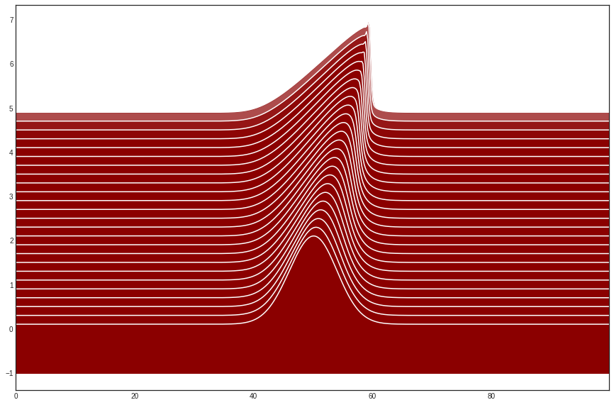

The burger equation
~~~~~~~~~~~~~~~~~~~

.. code:: ipython3

    import functools as ft
    import multiprocessing as mp
    import logging
    
    import numpy as np
    from scipy.signal import gaussian
    
    import pylab as pl
    
    from triflow import Model, Simulation, schemes, displays
    
    pl.style.use('seaborn-white')
    
    %matplotlib inline

Burgers' equation is a fundamental partial differential equation
occurring in various areas of applied mathematics, such as fluid
mechanics, nonlinear acoustics, gas dynamics, traffic flow. It is named
for Johannes Martinus Burgers (1895–1981).
(`Wikipedia <https://en.wikipedia.org/wiki/Convection%E2%80%93diffusion_equation>`__)

The viscous Burger equation in 1D reads:

.. math:: \partial_{t}U = k \partial_{xx} U - U \partial_{x} U

with

-  :math:`U` the velocity
-  :math:`k` a diffusion convection

The expected behaviour is a wave moving forward with a growing shock.
This shock leads to discontinuity smoothed by the diffusion term.

.. code:: ipython3

    model = Model("k * dxxU - U * dxU",
                  "U", "k")

We discretize our spatial domain. ``retstep=True`` ask to return the
spatial step. We want periodic condition, so ``endpoint=True`` exclude
the final node (which will be redondant with the first node, :math:`x=0`
and :math:`x=100` are merged)

.. code:: ipython3

    x, dx = np.linspace(0, 100, 500, retstep=True, endpoint=False)

We initialize with a simple gaussian pulse initial condition.

.. code:: ipython3

    U = gaussian(x.size, 20) * 2
                
    fields = model.fields_template(x=x, U=U)
    
    pl.figure(figsize=(15, 4))
    pl.plot(fields.x, fields.U)
    pl.xlim(0, fields.x.max())
    pl.show()

.. image:: burger_equation_files/burger_equation_7_0.png

We precise our parameters. The default scheme provide an automatic
time\_stepping. We set the periodic flag to True

.. code:: ipython3

    parameters = dict(k=1E-1, c=20, periodic=True)

We initialize the simulation.

.. code:: ipython3

    t = 0
    simulation = Simulation(model, t, fields, parameters,
                            dt=.1, tmax=5, tol=1E-4)

We iterate on the simulation until the end.

.. code:: ipython3

    pl.figure(figsize=(15, 10))
    for i, (t, fields) in enumerate(simulation):
        if i % 2 == 0:
            pl.fill_between(fields.x, fields.U + .1 * (i + 1),
                            fields.U.min() - 1,
                            color='darkred', zorder=-2 * i, alpha=.7)
            pl.plot(fields.x, fields.U + .1 * (i + 1), 
                    color='white',
                    zorder=-(2 * i) + 1)
        print(f"t: {t:g}".ljust(80), end='\r')
    pl.xlim(0, fields.x.max())
    pl.show()

.. parsed-literal::

    t: 5                                                                            

