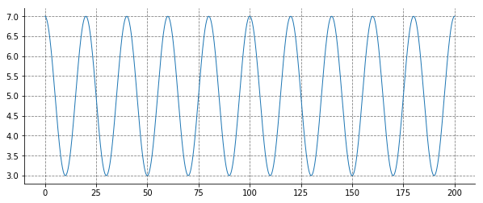
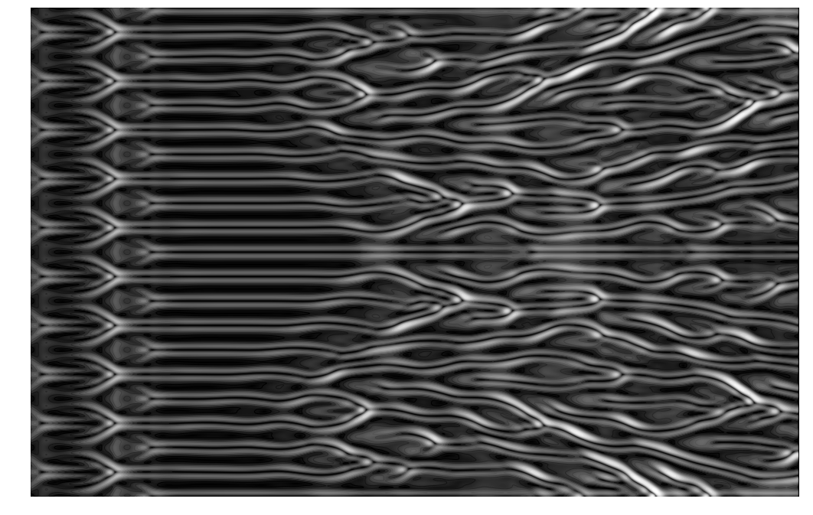

Kuramoto–Sivashinsky equation
=============================

.. code:: ipython3

    import triflow as trf
    import scipy.signal as spsig
    import numpy as np
    import pylab as pl
    from skimage.filters import sobel
    
    pl.style.use("publication")
    %matplotlib inline

.. code:: ipython3

    model = trf.Model("-dxxzeta - dxxxxzeta + (dxzeta)**2", "zeta")

.. code:: ipython3

    x = np.linspace(0, 200, 2010)
    noise = np.random.randn(x.size) * 3E-1 * 0
    zeta = np.cos(x * 2 * np.pi / x.max() * 10) * 2 + 5 + noise
    
    pl.figure(figsize=(10, 4))
    pl.plot(x, zeta)
    pl.show()

.. code:: ipython3

    def zeta_mean(simul):
        simul.fields["zeta_mean"] = "x", simul.fields.zeta - simul.fields.zeta.mean("x")
        return simul

.. code:: ipython3

    simul = trf.Simulation(model, fields=model.fields_template(x=x, zeta=zeta),
                       dt=.2, tmax=200, tol=5E-0, parameters=dict(periodic=True))
    simul.add_post_process("compute_zeta_mean", zeta_mean)
    container = simul.attach_container()
    curve = trf.display_fields(simul)
    curve.hv_curve.redim.range(zeta=(0, None))

.. raw:: html

    

        

          
    

        

    

        

        

.. code:: ipython3

    results = simul.run()

.. parsed-literal::

    HBox(children=(IntProgress(value=0, max=999), HTML(value='')))

.. parsed-literal::

    

.. code:: ipython3

    data = (simul.container.data.zeta - simul.container.data.zeta.mean("x")).T.values

.. code:: ipython3

    fig = pl.figure(figsize=(18, 18 / (1568 / 1024)))
    pl.pcolormesh(filt(data), cmap="Greys_r")
    pl.contour(filt(data), 20, cmap="Greys_r")
    pl.grid(False)
    pl.axis('off')
    pl.savefig("../../source_doc/source/_static/images/bg.jpg", bbox_inches='tight')

.. code:: ipython3

    !convert ../../source_doc/source/_static/images/bg.jpg ../../source_doc/source/_static/images/bg.png
