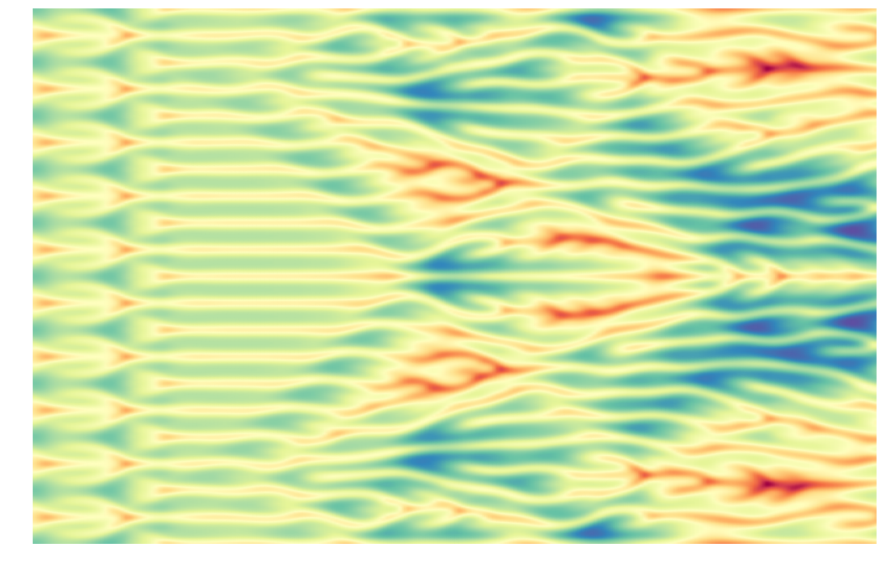

.. code:: ipython3

    from triflow import Model, Simulation, display_fields
    import scipy.signal as spsig
    import numpy as np
    
    import pylab as pl
    
    import warnings
    warnings.filterwarnings("ignore")
    
    pl.style.use("publication")
    %matplotlib inline

.. code:: ipython3

    model = Model("-dxxzeta - dxxxxzeta + (dxzeta)**2", "zeta")

.. code:: ipython3

    x = np.linspace(0, 200, 1010)
    # zeta = np.random.randn(x.size) * 1E1 + 50
    zeta = np.cos(x * 2 * np.pi / x.max() * 10) * 2 + 5
    
    pl.figure(figsize=(10, 4))
    pl.plot(x, zeta)
    pl.show()

.. image:: kuramoto_files/kuramoto_2_0.png

.. code:: ipython3

    simul = Simulation(model,
                       fields=model.fields_template(x=x, zeta=zeta),
                       dt=1, tmax=200, tol=5E-0,
                       parameters=dict(periodic=True),
                       )
    simul.attach_container()
    display_fields(simul)

.. raw:: html

    

        

          
    

        

    

        

        

.. code:: ipython3

    for i, (t, fields) in enumerate(simul):
        print(t, end='\r')

.. parsed-literal::

    200.0

.. code:: ipython3

    pl.figure(figsize=(18, 18 / (1568 / 1024)))
    pl.pcolormesh((simul.container.data.zeta - simul.container.data.zeta.mean("x")).T,
                  cmap="Spectral", shading="gouraud")
    pl.grid(False)
    pl.axis('off')
    pl.savefig("../../docs/images/bg.png", bbox_inches='tight')

.. code:: ipython3

    import pillow

::

    -------------------------------------

    ModuleNotFoundErrorTraceback (most recent call last)

    <ipython-input-53-e32915389b2c> in <module>()
    ----> 1 import pillow
    

    ModuleNotFoundError: No module named 'pillow'

