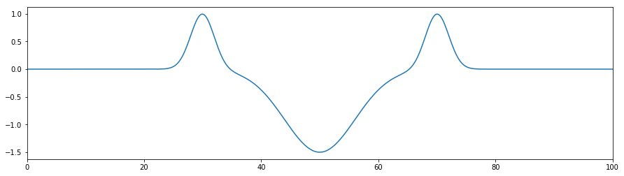
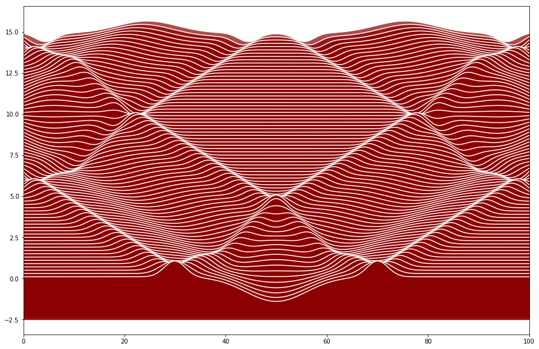

Wave equation
~~~~~~~~~~~~~

.. code:: ipython3

    import functools as ft
    import multiprocessing as mp
    import logging
    
    import numpy as np
    from scipy.signal import gaussian
    
    import pylab as pl
    
    from triflow import Model, Simulation, schemes, displays
    
    %matplotlib inline

We initialize the model with the wave equation written as a system of
first order differential equations.

.. math:: \partial_{t,\,t}u = c^2 \partial_{x,\,x} u

which lead to

.. raw:: latex

   \begin{align}
       \partial_{t}u &= v\\
       \partial_{t}v &= c^2 \partial_{x,\,x} u
   \end{align}

with :math:`c` the velocity of the wave.

.. code:: ipython3

    model = Model(["c**2 * dxxu", "v"],
                   ["v", "u"], "c")

We discretize our spatial domain. ``retstep=True`` ask to return the
spatial step.

.. code:: ipython3

    x, dx = np.linspace(0, 100, 500, retstep=True)

We initialize with three gaussian pulses for the initial condition

.. code:: ipython3

    u = (np.roll(gaussian(x.size, 10), x.size // 5) +
         np.roll(gaussian(x.size, 10), -x.size // 5) -
         gaussian(x.size, 30) * 1.5)
    v = np.zeros_like(u)
    
    fields = model.fields_template(x=x, u=u, v=v)
    
    pl.figure(figsize=(15, 4))
    pl.plot(fields.x, fields.u)
    pl.xlim(0, fields.x.max())
    pl.show()

We precise our parameters. The default scheme provide an automatic
time\_stepping. We want dirichlet boundary condition, so we set the
periodic flag to False.

.. code:: ipython3

    parameters = dict(c=5, periodic=False)

This function will set the boundary condition. We will have a fixed rope
at each edge.

.. code:: ipython3

    def dirichlet(t, fields, pars):
        # fields.u[:] = np.sin(t * 2 * np.pi * 2) * gaussian(x.size, 10) - fields.u[:]
        fields.u[0] = 0
        fields.u[-1] = 0
        fields.v[0] = 0
        fields.v[-1] = 0
        return fields, pars

We initialize the simulation, and we set a bokeh display in order to
have real-time plotting.

.. code:: ipython3

    t = 0
    simulation = Simulation(model, t, fields, parameters,
                            dt=.1, tmax=15,
                            hook=dirichlet)

We iterate on the simulation until the end.

.. code:: ipython3

    pl.figure(figsize=(15, 10))
    for i, (t, fields) in enumerate(simulation):
        if i % 2 == 0:
            pl.fill_between(fields.x, fields.u + .1 * (i + 1),
                            fields.u.min() - 1,
                            color='darkred', zorder=-2 * i, alpha=.7)
            pl.plot(fields.x, fields.u + .1 * (i + 1), 
                    color='white',
                    zorder=-(2 * i - 1))
        print(f"t: {t:g}".ljust(80), end='\r')
    pl.xlim(0, fields.x.max())
    pl.show()

.. parsed-literal::

    t: 15                                                                           

